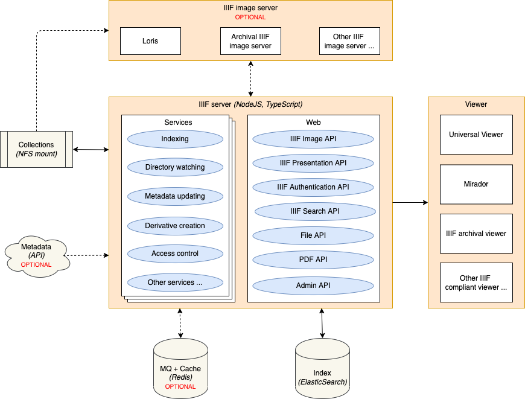
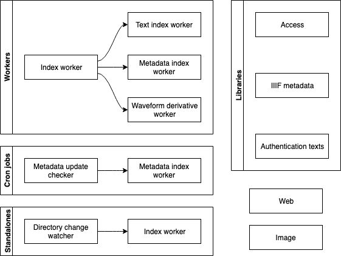
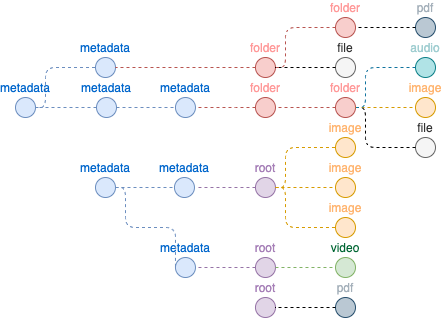

# Archival IIIF server

The Archival IIIF server indexes and provides [IIIF](https://iiif.io) services for digital collections. The server can
be configured with a number of different services to index the digital collections and to create derivatives.

1. [Components](#components)
2. [Services](#services)
    1. [Default services](#default-service)
    2. [Workers](#workers)
    3. [Cron jobs](#cron-jobs)
    4. [Standalones](#standalones)
    5. [Libraries](#libraries)
3. [Web API](#web-api)
    1. [IIIF Image API](#iiif-image-api)
    2. [IIIF Presentation API](#iiif-presentation-api)
    3. [IIIF Content Search API](#iiif-content-search-api)
    4. [IIIF Authentication API](#iiif-authentication-api)
    5. [File API](#file-api)
    6. [PDF API](#pdf-api)
    7. [Text API](#text-api)
    8. [Helper API](#helper-api)
    9. [Admin API](#admin-api)
4. [Installation](#installation)
    1. [Docker Compose](#docker-compose)
    2. [Manual installation](#manual-installation)
5. [Configuration](#configuration)
6. [Data model](#data-model)
    1. [Items](#items)
    2. [Texts](#texts)

## Components

The Archival IIIF server is composed of a web application and various service workers. The service workers index
collections to [ElasticSearch](https://www.elastic.co/webinars/getting-started-elasticsearch), while the web environment
gives access to the index through various [IIIF API's](https://iiif.io/technical-details).
[Redis](https://redis.io) is used to manage the communication between various service workers and provides additional
caching capabilities.

## Services

The Archival IIIF server comes with several services that can be turned on or off using the env variable
`IIIF_SERVER_SERVICES`.

### Default service

The `web` service runs the IIIF web environment.

### Workers

The worker services wait for new jobs to appear in a queue in [Redis](https://redis.io). A distinction is made between
index workers that indexes data in
[ElasticSearch](https://www.elastic.co/webinars/getting-started-elasticsearch) and derivative workers that create
specific derivatives of collection items. At the moment, the Archival IIIF server identifies a number of different
fileinfo of worker services:

- **Index worker**: Gets a job with the path of a collection to be indexed in
  [ElasticSearch](https://www.elastic.co/webinars/getting-started-elasticsearch). Current implementations:
    - `iish-index`: A specific IISH implementation of the index worker. Indexes DIPs created by the
      Archivematica instance of the IISH.
    - `ecodices-index`: A specific eCodices implementation of the index worker. Indexes DIPs created by the
      Archivematica instance of eCodices.
- **Text index worker**: Gets a job with a collection id and a list of all transcriptions/transliterations to be indexed
  in [ElasticSearch](https://www.elastic.co/webinars/getting-started-elasticsearch). Current implementations:
    - `text-index`: Indexes plain text files and ALTO files.
- **Reindex worker**: Gets a list of collections ids to be reindexed or a query for
  [ElasticSearch](https://www.elastic.co/webinars/getting-started-elasticsearch). Current implementations:
    - `archivematica-reindex`: An Archivematica implementation of the reindex worker. Can start reindexing for DIPs
      created by Archivematica instances.
- **Metadata index worker**: Gets a job with a collection id and/or a OAI identifier and obtains the metadata from an
  OAI endpoint to be indexed in [ElasticSearch](https://www.elastic.co/webinars/getting-started-elasticsearch). Current
  implementations:
    - `iish-metadata`: Looks for and indexes metadata from the OAI service of the IISH.
    - `niod-metadata`: Looks for and indexes metadata from NIOD.
    - `ecodices-metadata`: Looks for and indexes metadata from eCodices.
- **All metadata update worker**: Starts the metadata process again for all items. Current implementations:
    - `all-metadata-update`: Default implementation.
- **Waveform derivative worker**: Gets a job with a collection id and then builds waveform representations of all audio
  files of the collection with the given collection id. Current implementations:
    - `waveform`: Default implementation.
- **PDF image derivative worker**: Gets a job with a collection id and then builds JPG representations of the first page
  of all PDF files of the collection with the given collection id. Current implementations:
    - `pdf-image`: Default implementation.
- **Video image derivative worker**: Gets a job with a collection id and then extracts a still as JPG and creates a
  mosaic of stills with a WebVTT file from all video files of the collection with the given collection id. Current
  implementations:
    - `video-image`: Default implementation.
- **Process update worker**: Gets the process type to start and a query for
  [ElasticSearch](https://www.elastic.co/webinars/getting-started-elasticsearch). Current implementations:
    - `process-update`: Default implementation.

### Cron jobs

The cron job services run periodically. At the moment, the Archival IIIF server identifies one cron job:

- **Metadata update**: Checks periodically whether some metadata has to be updated. Current implementations:
    - `iish-metadata-update`: Runs daily to query the OAI service of the IISH for updates and sends those to the
      metadata indexer.

### Standalones

The standalone services do not wait on a trigger like the workers or cron jobs. At the moment, the Archival IIIF server
identifies one standalone service:

- **Directory watcher**: Watches a directory for any changes (new collections) and sends those to the index worker to be
  indexed. Current implementations:
    - `directory-watcher-changes`: When a directory has had no changes for a certain amount of time, it is assumed that
      it is safe to send the directory to the index worker to be indexed.
    - `directory-watcher-file-trigger`: When a directory is updated with a specific file, it triggers the index worker
      to be indexed.

### Libraries

The libraries are lightweight services with specific implementation details that can run together with the
`web` service on the same running instance. At the moment, the Archival IIIF server identifies three different
libraries:

- **Access**: Determines whether a user has (limited) access to a specific item. Current implementations:
    - `default-access`: All granted; default implementation
    - `iish-access`: IISH specific implementation.
    - `niod-access`: NIOD specific implementation.
- **Authentication texts**: Provides implementation specific texts to help the user with authenticating. Current
  implementations:
    - `default-auth-texts`: Default implementation.
    - `iish-auth-texts`: IISH specific implementation.
- **Basic IIIF metadata**: Provides implementation specific IIIF metadata. Current implementations:
    - `default-basic-iiif-metadata`: Default (no IIIF metadata) implementation.
    - `iish-basic-iiif-metadata`: IISH specific implementation.
    - `ecodices-basic-iiif-metadata`: eCodices specific implementation.
- **Canvas IIIF metadata**: Provides implementation specific IIIF metadata for a canvas. Current implementations:
    - `default-canvas-iiif-metadata`: Default (no IIIF metadata) implementation.
    - `ecodices-canvas-iiif-metadata`: eCodices specific implementation.
- **Root file item**: Provides implementation specific logic to determine the child item which represent the root:
    - `default-root-file-item`: Default implementation: always the first page.
    - `iish-root-file-item`: IISH specific implementation.
    - `ecodices-root-file-item`: eCodices specific implementation.
- **Top collections**: Provides implementation specific IIIF top collections:
    - `default-top-collections`: Default implementation listing all IIIF collections/manifests.
    - `iish-top-collections`: IISH specific implementation.

## Web API

### IIIF Image API

_See also the [IIIF Image API 2.1](https://iiif.io/api/image/2.1/)
and the [IIIF Image API 3.0](https://iiif.io/api/image/3.0/)_

**URL**: `/iiif/image/[id]` / `/iiif/image/[id]/info.json`

**Method**: `GET`

IIIF Image API. Returns the JSON-LD description for the image with the given id.

---

**URL**: `/iiif/image/[id]/[region]/[size]/[rotation]/[quality].[format]`

**Method**: `GET`

IIIF Image API. Returns the image with the given id for the specified options.

### IIIF Presentation API

_See also the [IIIF Presentation API 2.1](https://iiif.io/api/presentation/2.1/)
and the [IIIF Presentation API 3.0](https://iiif.io/api/presentation/3.0/)_

**URL**: `/iiif/presentation/collection/[id]`

**Method**: `GET`

IIIF Presentation API. Returns the JSON-LD description for the collection with the given id.

---

**URL**: `/iiif/presentation/[id]/manifest`

**Method**: `GET`

IIIF Presentation API. Returns the JSON-LD description for the manifest with the given id.

---

**URL**: `/iiif/presentation/[id]/annopage/[annotation-page-id]`

**Method**: `GET`

IIIF Presentation API. Returns the JSON-LD description for the annotation page with the given annotation page id for a
manifest with the given id.

### IIIF Content Search API

_See also the [IIIF Content Search API](https://iiif.io/api/search/1.0/)_

**URL**: `/iiif/search/[id]`

**Method**: `GET`

IIIF Content Search search API. Search the text of a manifest with the given id.

---

**URL**: `/iiif/search/[id]/[type]`

**Method**: `GET`

IIIF Content Search search API. Search the text of a given type, of a manifest with the given id.

---

**URL**: `/iiif/search/[id]/[type]/[language]`

**Method**: `GET`

IIIF Content Search search API. Search the text of a given type and given language, of a manifest with the given id.

---

**URL**: `/iiif/autocomplete/[id]`

**Method**: `GET`

IIIF Content Search autocomplete API. Autocompletion for the text of a manifest with the given id.

---

**URL**: `/iiif/autocomplete/[id]/[type]`

**Method**: `GET`

IIIF Content Search autocomplete API. Autocompletion for the text of a given type, of a manifest with the given id.

---

**URL**: `/iiif/autocomplete/[id]/[type]/[language]`

**Method**: `GET`

IIIF Content Search autocomplete API. Autocompletion for the text of a given type and given language, of a manifest with
the given id.

### IIIF Authentication API

_See also the [IIIF Authentication API](https://iiif.io/api/auth/1.0/)_

**URL**: `/iiif/auth/login`

**Method**: `GET`

IIIF login service. Shows a login screen based on an internal token store.

---

**URL**: `/iiif/auth/login`

**Method**: `POST`

**Parameters**: `token`

Checks the provided token with the internal token store.

---

**URL**: `/iiif/auth/cookie`

**Method**: `GET`

**Parameters**: `token`, `redirect`

IIIF cookie service. Sets an authorization cookie based on the internal token store and then redirects the user.

---

**URL**: `/iiif/auth/token`

**Method**: `GET`

**Parameters**: `token`

IIIF token service.

---

**URL**: `/iiif/auth/logout`

**Method**: `GET`

IIIF logout service.

### File API

**URL**: `/file/[id]` / `/file/[id]/original` / `/file/[id]/access`

**Method**: `GET`

Provides access to the file with the given id. Explicit access to the original copy or the access copy can be provided.

---

**URL**: `/file/[id]/[derivative-type]`

**Method**: `GET`

Provides access to the derivative of the given type for the file with the given id.

### PDF API

**URL**: `/pdf/[id]`

**Method**: `GET`

**Parameters**: `pages`

Generates a PDF version of a collection with the given id.

### Text API

**URL**: `/text/[id]`

**Method**: `GET`

Obtain an HTML version of the text with the given id.

---

**URL**: `/text/[id]/txt`

**Method**: `GET`

Obtain plain text version of the text with the given id.

### Helper API

**URL**: `/helper/viewer`

**Method**: `GET`

**Parameters**: `manifest`

Opens a given IIIF manifest in the configured viewer.

### Admin API

**URL**: `/admin/worker_status`

**Method**: `GET`

Shows that status of all workers. Can only be used by an administrator with a valid access token.

---

**URL**: `/admin/index`

**Method**: `POST`

**Parameters**: `path`

Creates a job for the index worker to index the collection on the given path. Can only be used by an administrator with
a valid access token.

---

**URL**: `/admin/index_api`

**Method**: `POST`

Indexes the request body right away. Can only be used by an administrator with a valid access token.

---

**URL**: `/admin/reindex`

**Method**: `POST`

**Parameters**: `collection_id`, `query`

Creates a job for the reindex worker to index for the given collection ids or using the given ElasticSearch query. Can
only be used by an administrator with a valid access token.

---

**URL**: `/admin/update_metadata`

**Method**: `POST`

**Parameters**: `metadata_id`, `root_id`, `collection_id`

Creates a job for the metadata worker to force-update the metadata for the given metadata id and/or root/collection id.
Can only be used by an administrator with a valid access token.

---

**URL**: `/admin/all_metadata_update`

**Method**: `POST`

Create jobs for the metadata worker to force-update all the metadata. Can only be used by an administrator with a valid
access token.

---

**URL**: `/admin/process_update`

**Method**: `POST`

**Parameters**: `type`, `query`

Creates a job for the process update worker to start a process of the given type using the given ElasticSearch query.
Can only be used by an administrator with a valid access token.

---

**URL**: `/admin/register_token`

**Method**: `POST`

**Parameters**: `token`, `id`, `from`, `to`

Registers a token which may give access to a specific id for a specific period of time. Can only be used by an
administrator with a valid access token.

## Installation

Use the provided Docker Compose or install manually.

### Docker Compose

1. Set up any IIIF image compliant server. The Docker Compose comes with support for:
    * [Our image server](https://github.com/archival-IIIF/image-server).
    * [Loris](https://github.com/loris-imageserver/loris).
2. See for example the provided `docker-compose.yml.example`:
    * Note: Clone the `web` service definition to create multiple services and use the env variable
      `IIIF_SERVER_SERVICES` to define which services that container should run.
3. Set up the configuration (See .env.example for the example configuration)
    * Set up the environment variables in the Docker Compose file
4. Set up volumes for the following:
    * `data`: The volume which contains the collections to be indexed or files to be read, but also allows write access
      for derivative creation
    * `indexes`: The volume for ElasticSearch indexes to be stored
    * `redis-persistance`: The volume for Redis storage

### Manual installation

1. Set up any IIIF image compliant server:
    * Use our [image server](https://github.com/archival-IIIF/image).
    * Or set up any IIIF image compliant server.
2. Install
    * [Node.js 18.x LTS](https://nodejs.org/en)
    * [yarn](https://yarnpkg.com) or [npm](https://www.npmjs.com)
    * [ElasticSearch 7.x.x](https://www.elastic.co/webinars/getting-started-elasticsearch)
    * IIIF image server (e.g. [Loris](https://github.com/loris-imageserver/loris))
    * (Optional) [Redis 7.x](https://redis.io) (Required for caching, workers and/or IIIF authentication)
    * (Optional) [pm2](https://github.com/Unitech/pm2) (Required for managing the processes)
3. Install optional dependencies for derivative creation
    * [audiowaveform](https://github.com/bbc/audiowaveform) (Required by the `waveform` service)
    * [ghostscript](https://www.ghostscript.com) (Required by the `pdf-image` service)
    * [ffmpeg](https://ffmpeg.org) (Required by the `video-image` service)
4. Set up the configuration (See .env.example for the example configuration)
    * Copy .env.example to .env and set up the parameters for development
    * Set up the environment variables for production
    * With PM2, [set up a config.yml file](https://pm2.io/doc/en/runtime/guide/ecosystem-file/)
      with the environment variables
5. Run `npm install` or `yarn install`
6. Run `tsc` to transpile the application
7. Start the application:
    * Run `node src/app.js`
    * With PM2: `pm2 start config.yml`

## Configuration

The environment variables used to configure the application:

- `NODE_ENV`: Should be `production` in a production environment
- `IIIF_SERVER_SERVICES`: Comma separated list of services to run on this instance:
    - General services:
        - `web`: Sets up a **web server** and the web environment
        - `directory-watcher-changes`:  Runs a **standalone** script that watches a directory for new collections to
          index: when a collection has had no changes for a certain amount of time, the index is triggered
        - `directory-watcher-file-trigger`: Runs a **standalone** script that watches a directory for new collections to
          index: when a collection includes a trigger file, the index is triggered
        - `text-index`: Runs a **worker** that indexes texts (transcriptions, translations, etc.)
        - `process-update`: Runs a **worker** that triggers other workers to run for specific items
        - `all-metadata-update`: Runs a **worker** that triggers a reindex of all metadata
        - `default-access`: Loads a **library** that grants access to all items
        - `default-auth-texts`: Loads a **library** that provides authentication empty assistance texts
        - `default-basic-iiif-metadata`: Loads a **library** that provides no basic IIIF metadata
        - `default-canvas-iiif-metadata`: Loads a **library** that provides no canvas IIIF metadata
        - `default-root-file-item`: Loads a **library** that provides the child item representative for the root item
        - `default-top-collections`: Loads a **library** that provides top IIIF collections
    - Derivative services:
        - `waveform`: Runs a **worker** that creates waveforms from audio files
        - `pdf-image`: Runs a **worker** that creates images from pdf files
        - `video-image`: Runs a **worker** that creates images from video files
    - IISH specific services:
        - `iish-archivematica-index`: Runs a **worker** that indexes IISH DIPs from Archivematica
        - `iish-archivematica-reindex`: Runs a **worker** that reindexes IISH DIPs from Archivematica
        - `iish-metadata`: Runs a **worker** that indexes IISH metadata (MARCXML / EAD)
        - `iish-metadata-update`: Runs a **cron job** that processes changes in the IISH metadata
        - `iish-access`: Loads a **library** that determines access to items for IISH collections
        - `iish-auth-texts`: Loads a **library** that provides authentication assistance texts of items from IISH
          collections
        - `iish-basic-iiif-metadata`: Loads a **library** that provides IIIF metadata of items from IISH collections
        - `iish-root-file-item`: Loads a **library** that provides the child item representative for the root item of
          items from IISH collections
        - `iish-top-collections`: Loads a **library** that provides top IIIF collections for IISH collections
    - NIOD specific services:
        - `niod-metadata`: Runs a **worker** that indexes NIOD metadata
        - `niod-access`: Loads a **library** that determines access to items for NIOD collections
    - eCodices specific servies:
        - `ecodices-index`: Runs a **worker** that indexes eCodices DIPs from Archivematica
        - `ecodices-metadata`: Runs a **worker** that indexes eCodices metadata
        - `ecodices-basic-iiif-metadata`: Loads a **library** that provides IIIF metadata of items from eCodices
          collections
        - `ecodices-canvas-iiif-metadata`: Loads a **library** that provides IIIF metadata of canvases from eCodices
          collections
        - `ecodices-root-file-item`: Loads a **library** that provides the child item representative for the root item
          of items from eCodices collections
- `IIIF_SERVER_SECRET`: Signed cookie key
- `IIIF_SERVER_ACCESS_TOKEN`: Access token for administrator access
- `IIIF_SERVER_IMAGE_SERVER_URL`: URL of the external IIIF image server (such as Loris)
- `IIIF_SERVER_IMAGE_SERVER_NAME`: Name of the image server (either 'loris' or 'sharp')
- `IIIF_SERVER_METADATA_OAI_URL`: URL of the OAI metadata provider
- `IIIF_SERVER_METADATA_SRW_URL`: URL of the SRW metadata provider
- `IIIF_SERVER_IMAGE_TIER_SEPARATOR`: Separator character to separate between the image identifier and the image tier
- `IIIF_SERVER_MAX_TASKS_PER_WORKER`: The maximum number of tasks a single type of worker can load at the same time
- `IIIF_SERVER_PORT`: Port to run the web server
- `IIIF_SERVER_ATTRIBUTION`: Attribution to add to the IIIF manifests
- `IIIF_SERVER_BASE_URL`: The public base URL of the application
- `IIIF_SERVER_VIEWER_URL`: The URL of the main IIIF viewer to use (the manifest URI will be added to this URL)
- `IIIF_SERVER_HOT_FOLDER_PATH`: The path to the hot folder where new collections to be indexed are placed
- `IIIF_SERVER_HOT_FOLDER_PATTERN`: The pattern of a file in the root of a new collection to trigger indexing
- `IIIF_SERVER_DATA_ROOT_PATH`: The root path of the data storage
- `IIIF_SERVER_COLLECTIONS_REL_PATH`: The relative path of the (read-only) collections under the data storage root path
- `IIIF_SERVER_DERIVATIVE_REL_PATH`: The relative path of the (read-write) derivatives under the data storage root path
- `IIIF_SERVER_LOGO_REL_PATH`: The relative path to the image with the logo to add to the IIIF manifests
- `IIIF_SERVER_AUDIO_REL_PATH`: The relative path to the image with the audio icon to add to the IIIF manifests
- `IIIF_SERVER_METADATA_PATH`: The path to the folder which contains all the metadata
- `IIIF_SERVER_PDF_PAGES_THRESHOLD`: If defined, limit dynamic PDF creation per IP address when over this configured
  threshold (Requires Redis volatile server)
- `IIIF_SERVER_PDF_SESSION_SECONDS`: If defined, the number of seconds to limit dynamic PDF creation per IP address (
  Requires Redis volatile server)
- `IIIF_SERVER_PDF_IMAGE_SIZE`: The (IIIF) size of images for the dynamic PDF creation (defaults to 'max')
- `IIIF_SERVER_VIDEO_MOSAIC_WIDTH`: The width of the thumbnails in the video mosaic derivative (defaults to 500)
- `IIIF_SERVER_VIDEO_TILES_ROWS`: The number of rows in the video mosaic derivative (defaults to 6)
- `IIIF_SERVER_VIDEO_TILES_COLUMNS`: The number of columns in the video mosaic derivative (defaults to 5)
- `IIIF_SERVER_LOG_LEVEL`: The logging level
- `IIIF_SERVER_IP_ADDRESS_HEADER`: The header to read the IP address from, instead of `HTTP_X_FORWARDED_FOR`
- `IIIF_SERVER_INTERNAL_IP_ADDRESSES`: If access may be granted based on IP address, provide a comma separated white
  list of ip addresses (Requires Redis persistent server)
- `IIIF_SERVER_LOGIN_ENABLED`: Turn login based authentication on/off (Requires Redis persistent server)
- `IIIF_SERVER_EXTERNAL_ENABLED`: Turn external based authentication on/off (Requires Redis persistent server)
- `IIIF_SERVER_DNS_CACHE_ENABLED`: Turns DNS caching on/off
- `IIIF_SERVER_ELASTICSEARCH_URL`: URL of the ElasticSearch indexer
- `IIIF_SERVER_ELASTICSEARCH_USER`: Username of the ElasticSearch indexer if authentication is enabled
- `IIIF_SERVER_ELASTICSEARCH_PASSWORD`: Password of the ElasticSearch indexer if authentication is enabled
- `IIIF_SERVER_ELASTICSEARCH_INDEX_PREFIX`: The prefix in front of the name of the indices 'items' and 'texts'
- `IIIF_SERVER_REDIS_VOLATILE_ENABLED`: Turn Redis volatile server on/off (Sets up caching)
- `IIIF_SERVER_REDIS_VOLATILE_HOST`: Host of the Redis caching server
- `IIIF_SERVER_REDIS_VOLATILE_PORT`: Port of the Redis caching server
- `IIIF_SERVER_REDIS_PERSIST_ENABLED`: Turn Redis persistent server on/off (Sets up jobs and auth tokens)
- `IIIF_SERVER_REDIS_PERSIST_HOST`: Host of the Redis persistent server
- `IIIF_SERVER_REDIS_PERSIST_PORT`: Port of the Redis persistent server

## Data model

The ElasticSearch index is configured with two different indexes: one for the `items` and one for the `texts`.

### Items

The `items` index consists of items which can be categorized into different fileinfo:

- `metadata`: Items which only have descriptive metadata (renders to a IIIF collection)
- `folder`: Items which will be rendered as a folder in a filesystem structure (renders to a IIIF collection)
- `root`: Items which describe a specific object (renders to a IIIF manifest)
- `range`: Items which describe a range within a specific object (renders to a range within a IIIF manifest)
- `file`: A file which cannot be categorized in one of the other file fileinfo
- `pdf`: A PDF file
- `image`: An image file
- `audio`: An audio file
- `video`: A video file

Using these fileinfo hierarchies can be build. Items with the type `metadata` always end up with either a `folder` or
a `root` type. Items with the `folder` or `root` type may not necessarily have a parent `metadata` item. Items with
a `folder` type may have child items which can be either `folder` fileinfo or any of the `file` fileinfo. Items with
a `root` type may only have child items which are any of the `file` fileinfo. Items with a `range` type appear for files
with a `root` type.

| Field         | Type     | Required                                    | Description                                                | 
|---------------|----------|---------------------------------------------|------------------------------------------------------------|
| id            | string   | Always                                      | The identifier of the item.                                |
| parent_id     | string   | If file type, range type or not root folder | The identifier of the parent item (creates a hierarchy).   |
| parent_ids    | string[] | If file type, range type or not root folder | The path of all items identifiers all the way to the root. |
| range_ids     | string[] | If file type                                | All range item identifiers.                                |
| collection_id | string   | Always                                      | The identifier of the root item or root folder item.       |
| metadata_id   | string   | If item contains descriptive metadata       | The identifier of the descriptive metadata used.           |
| type          | string   | Always                                      | One of the item types described above.                     |
| formats       | string[] |                                             | Categorization of formats.                                 |
| label         | string   | Always                                      | The label of the item.                                     |
| description   | string   |                                             | The description of the item.                               |
| authors       | object[] |                                             | All authors of the item.                                   |
| _type_        | string   | Always                                      |                                                            |
| _name_        | string   | Always                                      |                                                            |
| dates         | string[] |                                             | All dates of the item.                                     |
| physical      | string   |                                             | Physical information about the item.                       |
| size          | integer  | If file type                                | The file size.                                             |
| order         | integer  |                                             | A number to determine the order of all child items.        |
| created_at    | date     | If file or folder type                      | The date of file creation.                                 |
| width         | integer  | If image or video type                      | The width of the image / video.                            |
| height        | integer  | If image or video type                      | The height of the image / video.                           |
| resolution    | integer  | If image type                               | The resolution of the image.                               |
| duration      | double   | If audio or video type                      | The duration of the audio / video.                         |
| metadata      | object[] |                                             | Additional metadata as key/value pairs.                    |
| _label_       | string   | Always                                      |                                                            |
| _value_       | string   | Always                                      |                                                            |
| original      | object   | If file type either this or access          | Data about the original file.                              |
| _uri_         | string   | If file type either this or access          | Relative path to the original file.                        |
| _puid_        | string   |                                             | PRONOM identifier of the original file.                    |
| access        | object   | If file type either this or access          | Data about the access copy of the file.                    |
| _uri_         | string   | If file type either this or access          | Relative path to the access file.                          |
| _puid_        | string   |                                             | PRONOM identifier of the access file.                      |

### Texts

The `texts` index consists of all indexed text files. These can be either plain text files or ALTO-XML files.

| Field         | Type   | Required                      | Description                                                   | 
|---------------|--------|-------------------------------|---------------------------------------------------------------|
| id            | string | Always                        | The identifier of the text item.                              |
| item_id       | string | Always                        | The identifier of the file item.                              |
| collection_id | string | Always                        | The identifier of the root item or root folder item.          |
| type          | string | Always                        | Either a `transcription` or a `translation`.                  |
| language      | string |                               | The langauge of the text using `BCP 47` language codes.       |
| uri           | string | Always                        | Relative path to the source file.                             |
| source        | string | Always                        | Either `plain` or `alto`.                                     |
| text          | string | Always                        | The text (plain text version).                                |
| structure     | object | If word coordinates are known | Internally build structure of the text with word coordinates. |
