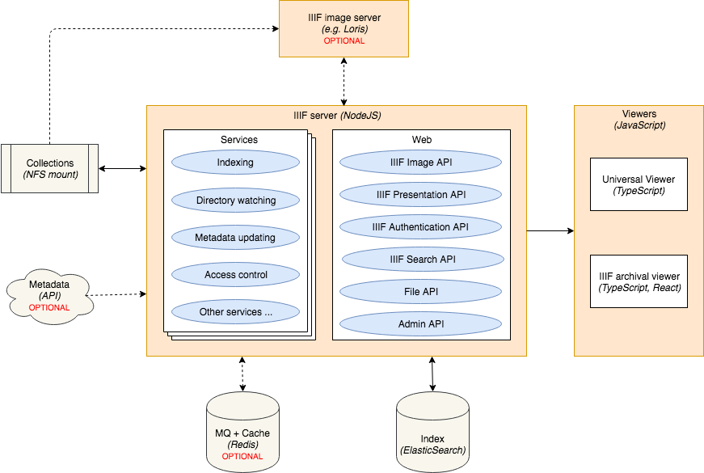

# Archival IIIF server

The Archival IIIF server indexes and provides [IIIF](https://iiif.io) services for digital collections. 
The server can be configured with a number of different services to index the digital collections 
and to create derivatives. 

The [IISH](https://iisg.amsterdam) (International Institute of Social History)  has created a number of services 
to index the DIPs created by [Archivematica](https://www.archivematica.org) and to give access through IIIF. 

## Components

The Archival IIIF server is composed of a web application and various service workers. 
The service workers index collections to [ElasticSearch](https://www.elastic.co/webinars/getting-started-elasticsearch), 
while the web environment gives access to the index through various [IIIF API's](https://iiif.io/technical-details). 
[Redis](https://redis.io) is used to manage the communication between various service workers 
and provides additional caching capabilities.

## Services

_TODO_

## Installation

Use the provided Docker Compose or install manually.

### Docker Compose

1. Decide which image server to use:
    * The application comes with a build-in image server using [Sharp](https://sharp.pixelplumbing.com). 
    Don't configure an image server URL or start a container with the `image` service to use this image server.
    * Or set up any IIIF image compliant server. 
    The docker compose comes with support for [Loris](https://github.com/loris-imageserver/loris).
1. Adapt the provided `docker-compose.yml`:
    * Clone the `web` service definition to create multiple services and use the env variable `IIIF_SERVER_SERVICES` 
    to define which services that container should run 
1. Set up volumes for the following:
    * `app-conf`: The PM2 configuration file
    * `universal-viewer-conf`: The Universal Viewer configuration file
    * `loris-conf`: The Loris configuration file (if Loris is used)
    * `data`: The volume which contains the collections to be indexed or files to be read, 
    but also allows write access for derivative creation
    * `indexes`: The volume for ElasticSearch indexes to be stored
    * `redis-persistance`: The volume for Redis storage
1. Set up the configuration (See .env.example for the example configuration)
   * [Set up a config.yml file](https://pm2.io/doc/en/runtime/guide/ecosystem-file/) with the environment variables
   * [Configure Loris](https://github.com/loris-imageserver/loris/blob/development/doc/configuration.md) 
   Especially the `src_img_root` configuration should point to the `data` volume
   * [Configure Universal Viewer](https://github.com/UniversalViewer/universalviewer/wiki/Configuration)

### Manual installation

1. Decide which image server to use:
    * The application comes with a build-in image server using [Sharp](https://sharp.pixelplumbing.com). 
    Don't configure an image server URL or start the `image` service to use this image server.
    * Or set up any IIIF image compliant server.
1. Install
    * [Node.js 10.x LTS](https://nodejs.org/en)
    * [yarn](https://yarnpkg.com) or [npm](https://www.npmjs.com)
    * [ElasticSearch 7.3.x](https://www.elastic.co/webinars/getting-started-elasticsearch)
    * (Optional) [Redis 5.x](https://redis.io) (Required for caching, workers and/or IIIF authentication)
    * (Optional) IIIF image server (e.g. [Loris](https://github.com/loris-imageserver/loris))
    * (Optional) [pm2](https://github.com/Unitech/pm2) (Required for managing the processes)
1. Install optional dependencies for derivative creation
    * [audiowaveform](https://github.com/bbc/audiowaveform) (Required by the `waveform` service)
1. Set up the configuration (See .env.example for the example configuration)
    * Copy .env.example to .env and set up the parameters for development
    * Set up the environment variables for production
    * With PM2, [set up a config.yml file](https://pm2.io/doc/en/runtime/guide/ecosystem-file/) 
    with the environment variables
1. `yarn install` or `npm install` (Use the `--production` flag for production with an external IIIF image server)
1. Start the application:
    * Run `yarn run start` or `npm run start`
    * With PM2: `pm2 start config.yml`

## Configuration

The environment variables used to configure the application:

- `NODE_ENV`: Should be `production` in a production environment
- `IIIF_SERVER_SERVICES`: Comma separated list of services to run on this instance:
    - General services:
        - `web`: Sets up a **web server** and the web environment
        - `image`: Sets up an **IIIF image server** using [Sharp](https://sharp.pixelplumbing.com)
        - `directory-watcher-changes`:  Runs a **standalone** script that watches a directory for new collections 
        to index: when a collection has had no changes for a certain amount of time, the index is triggered
        - `directory-watcher-file-trigger`: Runs a **standalone** script that watches a directory for new collections 
        to index: when a collection includes a trigger file, the index is triggered
        - `text-index`: Runs a **worker** that indexes texts (transcriptions, translations, etc.)
    - Derivative services:
        - `waveform`: Runs a **worker** that creates waveforms from audio files
    - IISH specific services:
        - `iish-archivematica-index`: Runs a **worker** that indexes IISH DIPs from Archivematica
        - `iish-metadata`: Runs a **worker** that indexes IISH metadata (MARCXML / EAD)
        - `iish-metadata-update`: Runs a **cron job** that processes changes in the IISH metadata
        - `iish-access`: Loads a **library** that determines access to items for IISH collections
        - `iish-auth-texts`: Loads a **library** that provides authentication assistance texts 
        of items from IISH collections
        - `iish-iiif-metadata`: Loads a **library** that provides IIIF metadata of items from IISH collections
- `IIIF_SERVER_SECRET`: Signed cookie key
- `IIIF_SERVER_ACCESS_TOKEN`: Access token for administrator access
- `IIIF_SERVER_ARCHIVAL_VIEWER_PATH`: Path to the Archival Viewer
- `IIIF_SERVER_UNIVERSAL_VIEWER_PATH`: Path to the Universal Viewer
- `IIIF_SERVER_UNIVERSAL_VIEWER_CONFIG_PATH`: Path to the configuration file of the Universal Viewer
- `IIIF_SERVER_IMAGE_SERVER_URL`: URL of the external IIIF image server (such as Loris)
- `IIIF_SERVER_IMAGE_SERVER_NAME`: Name of the image server (either 'loris' or 'sharp')
- `IIIF_SERVER_METADATA_OAI_URL`: URL of the OAI metadata provider
- `IIIF_SERVER_METADATA_SRW_URL`: URL of the SRW metadata provider
- `IIIF_SERVER_IMAGE_TIER_SEPARATOR`: Separator character to separate between the image identifier and the image tier
- `IIIF_SERVER_CACHE_DISABLED`: Turn caching on/off (Requires Redis)
- `IIIF_SERVER_PORT`: Port to run the web server
- `IIIF_SERVER_ATTRIBUTION`: Attribution to add to the IIIF manifests
- `IIIF_SERVER_BASE_URL`: The public base URL of the application
- `IIIF_SERVER_HOT_FOLDER_PATH`: The path to the hot folder where new collections to be indexed are placed
- `IIIF_SERVER_HOT_FOLDER_PATTERN`: The pattern of a file in the root of a new collection to trigger indexing
- `IIIF_SERVER_DATA_ROOT_PATH`: The root path of the data storage
- `IIIF_SERVER_COLLECTIONS_REL_PATH`: The relative path of the (read-only) collections under the data storage root path
- `IIIF_SERVER_LOGO_REL_PATH`: The relative path to the image with the logo to add to the IIIF manifests
- `IIIF_SERVER_LOGO_DIM`: The dimensions of the logo, separated by a ':'
- `IIIF_SERVER_LOG_LEVEL`: The logging level
- `IIIF_SERVER_INTERNAL_IP_ADDRESSES`: If access may be granted based on IP address, 
provide a comma separated white list of ip addresses (Requires Redis)
- `IIIF_SERVER_LOGIN_DISABLED`: Turn login based authentication on/off (Requires Redis)
- `IIIF_SERVER_ELASTICSEARCH_URL`: URL of the ElasticSearch indexer
- `IIIF_SERVER_REDIS_DISABLED`: Turn Redis on/off
- `IIIF_SERVER_REDIS_HOST`: Host of the Redis server (Requires Redis)
- `IIIF_SERVER_REDIS_PORT`: Port of the Redis server (Requires Redis)
